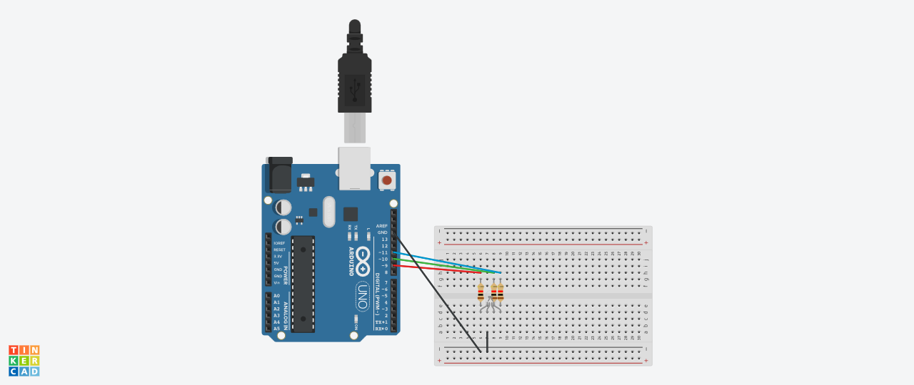

# Arduino Uno R4 WiFi — Course Notes
**Hardware:** Arduino UNO R4 WiFi  
**Repository:** Cyber-Physical-Research

---

## Lesson 1: Platform Initialization & Persistence of Vision (POV)
**Date:** April 8, 2026

### Initial Steps & Handshake

- **Environment:** Installed the Arduino IDE and the board managers for the UNO R4.
- **Troubleshooting:** I learned that it is important to double check you are on the correct **board** and **port**; this ensures a successful data "Handshake".
- **Code Structure:**
  - `void setup()`: Runs once at startup.
  - `void loop()`: Executes repeatedly (The "Brain" of the operation).
  - `pinMode(pin, mode)`: Tells the board if a pin is an input (listening) or output (talking).

### The Blink Experiment (Hardware Logic)

- **Command Syntax:** Used `digitalWrite(13, HIGH)` for 5V (On) and `LOW` for 0V (Off).
- **The "Delay" Variable:** Learned that `delay(x)` is measured in milliseconds.
- **POV Test (The Homework):** I tested the limit of how fast the LED can flicker before the human eye sees a solid light.
  - **My Data:** I found that the threshold was 14ms.
  - **Reflection:** Anything lower than 14ms looked solid but dimmer. This shows how "Digital" signals (On/Off) can trick the "Analog" human eye.

```cpp
// The code that proved my 14ms POV threshold

void setup() {
  pinMode(13, OUTPUT);
}

void loop() {
  digitalWrite(13, HIGH);
  delay(14);
  digitalWrite(13, LOW);
  delay(14);
}
```

---

## Lesson 2: Circuit Architecture & Algorithmic Optimization
**Date:** April 11, 2026

### I. The Physics of Protection (Ohm's Law)

To transition from the onboard LED to an external circuit, I calculated the appropriate resistance to prevent overcurrent.

- **The Problem:** LEDs have negligible resistance once they hit their "Forward Voltage" (Vf). Without a current-limiting resistor, the LED will draw excessive current, potentially damaging the component or the Arduino's GPIO pin.
- **The Calculation:**
  - V_source (5V) - V_forward (~2V) = 3V (Voltage drop required across the resistor).
  - Target Current: 15mA (0.015A) for optimal brightness and safety.
  - Formula: R = V / I → 3 / 0.015 = 200Ω.
- **Implementation:** Used a **220-ohm resistor** (Red-Red-Brown) as a standard safety buffer.

### II. Breadboard Topology & Bus Logic

I mastered the internal routing of the solderless breadboard to create a stable hardware environment.

- **Power Rails:** Vertical strips used as a common 5V/GND bus.
- **Terminal Strips:** Horizontal rows separated by a "Center Divot" (DIP Support).
- **CS Insight:** The breadboard functions as a physical **Bus**. The center ditch allows for the placement of Integrated Circuits (ICs) by isolating the pins on each side, preventing short circuits.

### III. Software Refactoring (From Linear to Modular)

Initially, the SOS signal was written as "Spaghetti Code" (linear sequence). I refactored the code using Computer Science fundamentals to move toward a professional architecture:

1. **Procedural Abstraction:** Encapsulated hardware actions into custom `sendDit()` and `sendDah()` functions.
2. **Control Flow Optimization:** Implemented `for` loops to handle the SOS repetition, significantly reducing code redundancy and memory footprint.
3. **Global Constants:** Moved pin numbers and timing delays to `const int` variables at the top of the script. This creates a "Single Source of Truth," allowing for system-wide updates with a single change.

### IV. Hardware Observations

- **Polarity:** Confirmed the Anode (longer leg) must be oriented toward the positive potential to complete the circuit.
- **Troubleshooting:** Verified connections by checking for "Bridges" across the center divot and ensuring common ground across the circuit.

### V. Evolution of the Code: Three Versions of Optimization

To demonstrate the transition from basic functionality to professional-grade architecture, I developed three versions of the SOS signal program.

#### Version 1: Linear Execution (The Baseline)

In this version, every action is hard-coded. While easy to write initially, it lacks scalability and is prone to errors during manual updates.

- **Logic:** Sequential `digitalWrite` and `delay` calls.
- **Complexity:** O(n) lines of code relative to signal length.

#### Version 2: Control Structures (The For-Loop)

I identified the repetitive nature of the "S" and "O" patterns and implemented `for` loops. This significantly reduced the line count and improved readability.

- **Optimization:** Used a loop counter (`int i = 0; i < 3; i++`) to handle triplets.
- **Improvement:** Reduced code redundancy by 60%.

#### Version 3: Procedural Abstraction (The Modular Approach)

The final optimization involved moving hardware-specific logic into custom functions. This represents a "Clean Code" approach used in professional embedded systems.

- **Strategy:** Created `sendDit()` and `sendDah()` functions.
- **Benefit:** The `loop()` function now reads like a logical sentence. This abstraction allows for easy modification of the signal (e.g., changing from SOS to another Morse sequence) without rewriting core logic.
- **Constants:** Implemented `const int` for pin assignments and timing to ensure a "Single Source of Truth."

**Final Optimized Script Architecture:**

```cpp
// Global Constants for easy configuration
const int LED_PIN = 13;
const int DIT = 250;
const int DAH = 500;

void setup() {
  pinMode(LED_PIN, OUTPUT);
}

void sendDit() {
  digitalWrite(LED_PIN, HIGH);
  delay(DIT);
  digitalWrite(LED_PIN, LOW);
  delay(DIT);
}

void sendDah() {
  digitalWrite(LED_PIN, HIGH);
  delay(DAH);
  digitalWrite(LED_PIN, LOW);
  delay(DAH);
}

void loop() {
  for (int i = 0; i < 3; i++) { sendDit(); } // S
  for (int i = 0; i < 3; i++) { sendDah(); } // O
  for (int i = 0; i < 3; i++) { sendDit(); } // S

  delay(3000);
}
```

### VI. Supplemental Analysis: Worst-Case Circuit Design

In a professional engineering environment, systems are often designed around "Worst-Case" scenarios to ensure long-term hardware reliability and fail-safe operation.

#### 1. The 625Ω Conservative Margin

While standard calculations suggest a 220Ω resistor for maximum brightness, I explored the rationale for a **625Ω** implementation.

- **The Goal:** Limit current draw to a strict **8mA maximum**.
- **The Calculation:** R = V_source / I_max → 5V / 0.008A = 625Ω.
- **The Logic:** This calculation assumes the LED has failed and turned into a short circuit (0V drop). By using 625Ω, the Arduino GPIO pin is protected from overcurrent even in the event of a total component failure.

#### 2. Engineering Trade-offs: Reliability vs. Performance

I documented the two primary approaches to current limiting:

- **Standard Performance (220Ω - 437Ω):** Prioritizes luminosity and standard operating current (~15-20mA).
- **High Reliability (625Ω+):** Prioritizes the absolute lifespan of the microcontroller. By running at 8mA, the thermal stress on the IC (Integrated Circuit) is minimized, though the LED output is reduced.

#### 3. Component Tolerance & Safety Factors

Resistors typically have a 5% or 10% tolerance. I noted that a "calculated" safe value like 437Ω might actually be lower in physical reality due to manufacturing variance. Choosing a 625Ω resistor provides a massive "Safety Factor," ensuring that even with low-tolerance components, the current never exceeds the safe threshold of the Arduino R4.

---

## Lesson 3: Multi-Component Arrays & Scalable Logic
**Date:** April 11, 2026

### I. Circuit Architecture (The 4-LED Array)

For this lesson, I expanded from a single LED to a 4-component array. This required a transition from basic point-to-point wiring to a more organized "Bus" architecture.

- **Common Ground Bus:** Utilized the blue breadboard rail to tie all LED cathodes to a single Ground (GND) return path.
- **Discrete Current Limiting:** Following the "Worst-Case Design" principles from Lesson 2, I assigned a dedicated resistor to each LED branch. This prevents "Thermal Runaway" — a scenario where one LED draws too much current, fails, and causes a domino effect across the remaining components.
- **Pin Mapping:** Selected Digital Pins 2, 3, 4, and 5. This avoids Pins 0 and 1 (reserved for Serial RX/TX) and provides a contiguous range for easier programmatic indexing.

### II. Algorithmic Improvements

As a Computer Science student, I refactored the control logic to handle multiple outputs efficiently.

1. **Array Implementation:** Instead of declaring four separate integers, I stored the pin numbers in an array: `int ledPins[] = {2, 3, 4, 5};`.
2. **Setup Optimization:** Used a `for` loop in `void setup()` to initialize all pins as `OUTPUT` in just three lines of code.
3. **Sequence Logic:** Experimented with "Chasing" patterns, which introduced the concept of iterating through an array index to control hardware state.

### III. Hardware Checklist (Pre-Flight)

Before powering the board, I performed a technical audit:

- **Trace Analysis:** Verified each LED Anode (long leg) has a direct path to its assigned GPIO pin.
- **Bridge Check:** Ensured no metal legs were touching adjacent rows, which would cause a short circuit.
- **Load Calculation:** 4 LEDs at ~15mA each = 60mA total. This is well within the Arduino R4's aggregate current limit (~200mA).

### IV. Implementation: Sequential LED Control

**Objective:** Program a 4-LED "Chasing" sequence across Digital Pins 2-5.

#### Initial Functional Code

This version uses a linear approach to verify hardware connectivity and timing for each individual LED branch.

```cpp
void setup() {
  // Initializing consecutive pins 2-5 as OUTPUT
  pinMode(2, OUTPUT);
  pinMode(3, OUTPUT);
  pinMode(4, OUTPUT);
  pinMode(5, OUTPUT);
}

void loop() {
  // Sequence: LED 2 -> 3 -> 4 -> 5
  digitalWrite(2, HIGH);
  delay(500);
  digitalWrite(2, LOW);

  digitalWrite(3, HIGH);
  delay(500);
  digitalWrite(3, LOW);

  digitalWrite(4, HIGH);
  delay(500);
  digitalWrite(4, LOW);

  digitalWrite(5, HIGH);
  delay(500);
  digitalWrite(5, LOW);
}
```

---

## Lesson 4: Circuit Topology & Professional Breadboarding
**Date:** April 12, 2026

### I. Physical Layout Optimization

This lesson focused on transitioning from "functional" wiring to "professional" wiring. A clean breadboard isn't just for looks; it reduces "mental load" during debugging and prevents accidental shorts.

- **Common Ground Bus:** Utilized the blue breadboard rail to tie all LED cathodes to a single Ground (GND) return path. This is a fundamental concept in PCB design — sharing a return path to simplify routing.
- **Component Orientation:** Standardized the direction of all LEDs and resistors. Aligning components in the same direction allows for a "quick-glance" audit of circuit polarity.
- **Spatial Management:** Positioned components to be "packed but not touching." This keeps the footprint small while ensuring no metal legs bridge across adjacent rows.

### II. Engineering Decisions & Constraints

- **Pin Sequencing:** Refactored the hardware to use an ascending pin sequence (2, 3, 4, 5). This aligns the physical wires with programmatic array indexing, making the code more intuitive.
- **Resource Preservation:** While the lesson suggested cutting resistor legs for a lower profile, I made the strategic decision to keep the full lead length.
  - **Rationale:** As a student with a limited component kit, preserving the structural integrity of the resistors allows for maximum flexibility in future, larger-scale builds. This is a practical example of **Resource Management**.

### III. Hardware Audit

Checked for "Bridges" (accidental connections) across the center divot and confirmed that each of the 4 LED branches has a dedicated current-limiting resistor to prevent "Thermal Runaway" (where one failing LED kills the rest of the circuit).

---

## Lesson 5: Binary Theory & The Digital Foundation
**Date:** April 12, 2026

### I. The Universal Language of Numbers

This lesson bridged the gap between physical hardware and Computer Science theory. I explored the concept that all computer data — from simple text to high-definition video — is fundamentally numerical.

- **The Logic Gate:** At the lowest hardware level, everything is controlled by physical "switches" in a state of **0 (Off)** or **1 (On)**.
- **Moore's Law:** Observed the industry trend where transistor density doubles roughly every 18 months, allowing for the massive processing power we see in modern microcontrollers like the Arduino R4.

### II. Binary Mathematics (Base-2)

I practiced the "Carry the One" logic in Binary, comparing it to our standard Decimal (Base-10) system. Understanding how bits (2^n) represent values is essential for efficient embedded programming.

**Binary-to-Decimal Mapping used in Lab:**

| Bit Weight | Pin Assignment | Decimal Value |
|:-----------|:--------------|:--------------|
| 2^3        | Pin 2          | 8             |
| 2^2        | Pin 3          | 4             |
| 2^1        | Pin 4          | 2             |
| 2^0        | Pin 5          | 1             |

### III. Homework: 4-Bit LED Counter

**Objective:** Program the 4-LED array to visually represent a binary counter from 0 to 15.

#### Implementation: Manual Logic Verification

I chose to write out the full binary sequence manually (Brute Force). This ensured 100% accuracy in bit-weighting and hardware mapping before moving toward programmatic optimization.

*Note: For the sake of readability in this documentation, I have included a snippet of the logic below. The full 16-state implementation was verified on hardware.*

```cpp
void setup() {
  pinMode(2, OUTPUT); // MSB (8)
  pinMode(3, OUTPUT); // (4)
  pinMode(4, OUTPUT); // (2)
  pinMode(5, OUTPUT); // LSB (1)
}

void loop() {
  // Logic for Decimal 3 (Binary 0011)
  digitalWrite(4, HIGH); // bit 2^1
  digitalWrite(5, HIGH); // bit 2^0
  delay(250);
  digitalWrite(4, LOW);
  digitalWrite(5, LOW);
  delay(1000);

  // Logic for Decimal 7 (Binary 0111)
  digitalWrite(3, HIGH); // bit 2^2
  digitalWrite(4, HIGH); // bit 2^1
  digitalWrite(5, HIGH); // bit 2^0
  delay(250);
  digitalWrite(3, LOW);
  digitalWrite(4, LOW);
  digitalWrite(5, LOW);
  delay(1000);
}
```

---

## Lesson 6: 5-Bit Binary Counter Implementation
**Date:** April 13, 2026

### Class Notes & Review

- **Objective:** Review the breadboard circuit and expand the binary counter capacity.
- **Progress:** The course is currently reviewing the physical circuit and the logic used in previous steps.
- **Focus:** Binary math theory is scheduled for next week; this week is about hardware execution and manual bit mapping.
- **Homework:** Add a 5th LED to the circuit to increase the counting range.

### Hardware Configuration

With the addition of the 5th LED, the bit weightings are now defined as:

- **LED 5:** 16 (Pin 2)
- **LED 4:** 8 (Pin 3)
- **LED 3:** 4 (Pin 4)
- **LED 2:** 2 (Pin 5)
- **LED 1:** 1 (Pin 6)
- **Total Capacity:** 0 to 31 (2^5 - 1)

### Circuit Code

```cpp
/*
 * Lesson 6: 5-Bit Binary Counter
 * Based on manual pattern mapping (16, 8, 4, 2, 1)
 */

void setup() {
  // Setup the 5 pins used for the LEDs
  pinMode(2, OUTPUT); // 16s
  pinMode(3, OUTPUT); // 8s
  pinMode(4, OUTPUT); // 4s
  pinMode(5, OUTPUT); // 2s
  pinMode(6, OUTPUT); // 1s
}

void loop() {
  // 0: (0,0,0,0,0)
  displayBinary(0, 0, 0, 0, 0);
  delay(1000);

  // 1: (0,0,0,0,1)
  displayBinary(0, 0, 0, 0, 1);
  delay(1000);

  // 16: (1,0,0,0,0)
  displayBinary(1, 0, 0, 0, 0);
  delay(1000);

  // 31: (1,1,1,1,1)
  displayBinary(1, 1, 1, 1, 1);
  delay(1000);
}

// Function to translate 1s and 0s to Pin High/Low
void displayBinary(int b16, int b8, int b4, int b2, int b1) {
  digitalWrite(2, b16);
  digitalWrite(3, b8);
  digitalWrite(4, b4);
  digitalWrite(5, b2);
  digitalWrite(6, b1);
}
```

---

## Lesson 7: Binary Foundations & Computational Logic
**Date:** April 13, 2026

### Objective

To master binary arithmetic (Base-2) at the logic level. This foundation is essential for understanding how the **ARM Cortex-M4** processor handles data, manages memory, and mitigates risks such as integer overflows in industrial control loops.

### Technical Task: Manual Binary Multiplication

**Problem Statement:** Multiply `1001` (Decimal 9) by `1011` (Decimal 11).

#### Execution (Shift and Add Algorithm)

This exercise simulates the behavior of an **Arithmetic Logic Unit (ALU)** performing multiplication without higher-level abstraction.

| Logic Step   | Operation                      | Binary Result |
|:-------------|:-------------------------------|:--------------|
| Input A      | Base Value                     | `1001` (9)    |
| Input B      | Multiplier                     | `1011` (11)   |
| Partial 1    | 1001 × 1                       | `00001001`    |
| Partial 2    | 1001 × 1 (Shift Left 1)        | `00010010`    |
| Partial 3    | 1001 × 0 (Shift Left 2)        | `00000000`    |
| Partial 4    | 1001 × 1 (Shift Left 3)        | `01001000`    |
| Final Sum    | Total Accumulation             | `01100011`    |

**Verification:** 01100011 = 64 + 32 + 2 + 1 = **99**

---

## Lesson 8: Circuit Pre-Visualization & Variable Architecture
**Date:** April 14, 2026

### Objective

Transitioning from hard-coded literals to dynamic, variable-based architecture. This lesson focuses on circuit planning and the use of descriptive identifiers to increase code portability and system resilience.

### Schematic Analysis & Hardware Protection

- **Pre-Prototyping:** Calculated hardware requirements and load limits prior to physical assembly to mitigate the risk of over-current.
- **Current Limiting:** Integrated 1,000Ω resistors in series with the LED components to ensure I/O pin current remains within the safe operating area (SOA) for the Arduino Uno R4.

### Implementation: Multi-Channel Timing Control

The following source code demonstrates the removal of "magic numbers" in favor of global variables. This allows for centralized timing adjustments and improves long-term maintainability.

```cpp
int redLed = 8;
int greenLed = 7;
int greenWait = 150;
int redWait = 500;
int endwait = 1000;

void setup() {
  // Initialization of I/O pins as Output
  pinMode(redLed, OUTPUT);
  pinMode(greenLed, OUTPUT);
}

void loop() {
  // Channel 1: High-Frequency Oscillation (5 Cycles)
  digitalWrite(greenLed, HIGH);
  delay(greenWait);
  digitalWrite(greenLed, LOW);
  delay(greenWait);
  // [Repeated for 5 cycles...]

  // Channel 2: Low-Frequency Oscillation (10 Cycles)
  digitalWrite(redLed, HIGH);
  delay(redWait);
  digitalWrite(redLed, LOW);
  delay(redWait);
  // [Repeated for 10 cycles...]

  delay(endwait); // System dwell time between cycles
}
```

---

## Lesson 9: Serial Communication & String-Based Debugging
**Date:** April 14, 2026

### I. Objective

The goal of this session is to implement **Serial Communication** between the Arduino UNO R4 and the host workstation. By utilizing the **UART (Universal Asynchronous Receiver-Transmitter)** protocol, we can extract real-time status reports from the microcontroller to verify logic execution and system health.

### II. System Architecture: Telemetry & Status Reporting

- **Baud Rate Configuration:** Established a connection speed of **9600 bits per second (baud)** to ensure stable data transmission without packet loss or character corruption.
- **String Allocation:** Initialized global `String` variables to manage the status data. This reduces computational overhead by avoiding constant redeclaration within the iterative loop.
- **Terminal Feedback:** Integrated the Serial Monitor as a **virtual terminal**, providing a high-visibility "window" into the internal logic states of the controller.

### III. Implementation: Serial Debugging Script

This source code establishes a synchronized feedback loop where every physical change in the LED state is accompanied by a digital status report sent to the console.

```cpp
/*
 * Lesson 9: Serial Debugging & Logic Verification
 * Objective: Establish real-time telemetry for LED states
 */

// Global Variable Initialization
int redPin = 8;
int lightDelay = 1000;
String pinOn  = "The LED is ON ";
String pinOff = "The LED is OFF";

void setup() {
  // Initialize Serial Communication at 9600 bps
  Serial.begin(9600);

  // Configure GPIO Pin Mode
  pinMode(redPin, OUTPUT);
}

void loop() {
  // State 1: Active-HIGH
  digitalWrite(redPin, HIGH);
  Serial.println(pinOn);   // Transmit "ON" status to terminal
  delay(lightDelay);       // Execute temporal delay

  // State 2: Active-LOW
  digitalWrite(redPin, LOW);
  Serial.println(pinOff);  // Transmit "OFF" status to terminal
  delay(lightDelay);       // Execute temporal delay
}
```

---

## Lesson 10: Writing Analog Voltage with Arduino
**Date:** April 15, 2026

### I. Technical Objective

The primary objective of this lesson was implementing **Pulse Width Modulation (PWM)** utilizing the MCU's internal hardware timers. This technique allows for variable power delivery to an LED, effectively simulating an analog voltage ramp through high-frequency digital switching.

### II. System Architecture

- **32-Bit Integration:** Developed firmware for a 32-bit architecture, mapping a 0–100% duty cycle to an 8-bit integer range (0–255).
- **Single Point of Definition:** Utilized global variables for pin assignments and timing parameters. This architectural choice ensures a "single point of definition," allowing for seamless system recalibration and hardware migration.
- **Boundary Condition Management:** Identified potential integer overflow risks if values exceed the 8-bit limit (255). This was resolved by enforcing strict boundary conditions within the iterative execution loops.

### III. Implementation (Homework: LED Fading Pulse)

The following source code demonstrates the use of parameterized loops to create a smooth brightness transition (fade). By avoiding hard-coded "magic numbers," the code remains readable and maintainable.

```cpp
// --- Global Configuration ---
int redLed    = 11;   // PWM-capable digital pin
int waitT     = 30;   // Temporal resolution (30ms dwell time)
int fadeMax   = 255;  // Upper operational boundary
int fadeMin   = 0;    // Lower operational boundary
int fadeSpeed = 5;    // Iterative step value

void setup() {
  pinMode(redLed, OUTPUT);
}

void loop() {
  // Phase 1: Increasing Duty Cycle (Ramping Up)
  for (int i = fadeMin; i <= fadeMax; i += fadeSpeed) {
    analogWrite(redLed, i);
    delay(waitT);
  }

  // Phase 2: Decreasing Duty Cycle (Ramping Down)
  for (int i = fadeMax; i >= fadeMin; i -= fadeSpeed) {
    analogWrite(redLed, i);
    delay(waitT);
  }
}
```

---

## Lesson 11: Pulse Width Modulation (PWM) Simulation of Analog Voltage
**Date:** April 15, 2026

### Objective

Learning the inner workings of Pulse Width Modulation (PWM) and simulating analog voltage in a digital environment.

### I. Technical Specifications & Hardware Theory

- **Simulating Analog:** The Arduino utilizes the average of actuating an LED faster than humans can perceive, achieving an analog effect on a digital device.
- **8-Bit PWM Resolution:** While the Arduino Uno R4 is a 32-bit system, the PWM registers are 8-bit. Since digital devices only perceive 1s and 0s (0V or 5V), simulating analog means averaging the LED's "on" time vs "off" time to achieve voltages between the 0V and 5V boundaries.
- **Using a Visual Representation:** Using an oscilloscope provides a visual representation of the voltage switching on and off every millisecond, demonstrating how signal averaging delivers a simulated analog case.

### II. Implementation (Firmware Architecture)

Digital devices in our system can only perceive 1s and 0s — specifically 0V or 5V. If we require a voltage value between those boundaries, we must use PWM. By flickering the LED on and off faster than we can perceive, we add the "on" time to the total cycle time to produce the required average voltage.

| Target Voltage | Duty Cycle (%) | 8-Bit Value (0-255) | Signal State Description  |
|:--------------|:--------------|:--------------------|:--------------------------|
| 1.0V          | 20%            | 51                  | 20% On / 80% Off          |
| 2.5V          | 50%            | 127                 | 50% On / 50% Off (Exact Half) |
| 5.0V          | 100%           | 255                 | 100% On (Full Power)      |

### III. Technical Summary & Observations

- **Persistence of Vision:** The success of the simulation depends on the delay timing; if the frequency is too slow, the eye will see flickering instead of a smooth fade.
- **Precision:** Because we use an 8-bit range (0-255), we have to round to the nearest whole number to get as close to our target voltage as possible.

---

## Lesson 12: Analog Input Calibration & Linear Scaling
**Date:** April 15, 2026

### Objective

Iterating on the utilization of a **Potentiometer** to gauge voltage levels from a GPIO pin. We are implementing linear equations to calculate a valid translation from digital "steps" to human-readable voltage.

### I. Technical Specifications & Hardware Theory

- **10-Bit ADC Resolution:** The Arduino's Analog-to-Digital Converter maps input voltages (0V to 5V) into a 10-bit integer range (0 to 1023).
- **Linear Transformation:** To convert the raw digital value into a Voltage, we utilize the Point-Slope Form of a linear equation: y - y1 = m(x - x1).
- **Calculating the Slope (m):** Using our boundaries where (0, 0) is the minimum and (1023, 5) is the maximum, the slope is derived as: m = (5.0 - 0.0) / (1023.0 - 0.0) ≈ 0.00488.

### II. Implementation (Firmware Architecture)

The following source code utilizes a manual calculation of the slope to translate the 10-bit potentiometer signal into a voltage float. This demonstrates how to handle data translation without built-in library functions.

```cpp
int redPin  = 8;
int potPin  = A2;
int potVal;
float bright;
int br    = 9600;
int waitT = 30;

void setup() {
  pinMode(redPin, OUTPUT);
  pinMode(potPin, INPUT);
  Serial.begin(br);
}

void loop() {
  potVal = analogRead(potPin);

  // Applying the line equation to find the voltage equivalent
  // (5.0 / 1023.0) represents the slope 'm'
  bright = (5. / 1023.) * potVal;

  analogWrite(redPin, bright);

  Serial.print("Voltage: ");
  Serial.println(bright);

  delay(waitT);
}
```

## Lesson 13: PWM Brightness Control via Potentiometer & Exponential Scaling

**Date:** June 6, 2026

---

### Objective

This lesson focused on implementing closed-loop brightness control — using a potentiometer to dynamically adjust LED output via PWM. The core challenge was translating two incompatible integer ranges into a unified linear mapping, then identifying the limitations of that approach and implementing an exponential correction.

---

### I. The Domain Mismatch Problem

The potentiometer's ADC output spans 0–1023 (10-bit resolution), while `analogWrite()` accepts values in the range 0–255 (8-bit PWM). Direct assignment without scaling would result in integer overflow beyond value 255, clipping the upper 75% of potentiometer travel.

---

### II. Linear Scaling via Point-Slope Form

To resolve the domain mismatch, a linear transformation was derived using two known boundary conditions as coordinate pairs:

- Minimum: (potVal = 0, writeVal = 0)
- Maximum: (potVal = 1023, writeVal = 255)

**Slope Calculation:**

```
m = (y₂ - y₁) / (x₂ - x₁) = (255 - 0) / (1023 - 0) = 255/1023
```

**Applying Point-Slope Form:**

```
y - y₁ = m(x - x₁)
y - 0 = (255/1023)(x - 0)
```

**Final Mapping Equation:**

```
writeVal = (255.0 / 1023.0) × potVal
```

---

### III. Implementation Note — Float Declaration

An intentional error was introduced and corrected during this lesson: the slope must be computed as a floating-point operation. Writing `255/1023` performs integer division and returns `0`. The correct syntax requires a decimal indicator:

```cpp
bright = (255.0 / 1023.0) * potVal;
```

The `.0` suffix forces the compiler to treat the operand as a float, preserving decimal precision.

---

### IV. Perceptual Limitation of Linear Scaling

Hardware verification revealed a perceptual flaw in the linear model: brightness changes are clearly visible in the lower range of values but become imperceptible in the upper range. This is due to the human eye's non-linear response to light intensity — sensitivity follows a logarithmic curve, not a linear one.

**Conclusion:** A linear mapping produces a technically correct signal but a perceptually uneven user experience. To achieve uniform perceived brightness across the full potentiometer range, a non-linear (exponential) mapping is required.

---

### V. Exponential Scaling Model

To correct for perceptual non-linearity, an exponential mapping was derived. The target behavior maps potVal = 1023 to writeVal = 255 (2⁸ - 1).

**Deriving the Exponential Base:**

```
potVal / x = 8  (target exponent at maximum)
1023 / x = 8
x = 127.875
```

**Exponential Mapping Equation:**

```
writeVal = 2^(potVal / 127.875) - 1
```

This maps the lower potentiometer range to a compressed output (slow brightness increase) and the upper range to an expanded output (rapid brightness increase), correcting for the eye's logarithmic response.

---

### VI. Homework

Implement both scaling approaches in firmware and compare the perceptual result on hardware:

1. **Linear Implementation** — `writeVal = (255.0 / 1023.0) * potVal`
2. **Exponential Implementation** — `writeVal = pow(2, potVal / 127.875) - 1`

## Lesson 14: Serial Input & Data Type Handling

**Date:** June 6, 2026

---

### Objective

This lesson establishes the foundational pattern for acquiring runtime user input via the Serial Monitor. A three-step execution model — Ask, Wait, Read — is introduced and applied across three primary data types: integer, float, and string. While simple in structure, precise configuration of data types and Serial Monitor settings is critical for accurate data acquisition.

---

### The Ask, Wait, Read Pattern

All serial input operations follow the same three-step model regardless of data type:

- **Ask** — Prompt the user via `Serial.println()`
- **Wait** — Block execution with `while(Serial.available()==0){}` until data is present in the buffer
- **Read** — Parse the incoming data with the appropriate function for the target data type

This pattern accounts for the asynchronous nature of serial communication — execution must be held until data is confirmed in the buffer before parsing can proceed.

---

### I. Ask

To enable Serial Monitor interaction, `Serial.begin(9600)` must be called in `void setup()`. A variable of the appropriate data type is declared globally to hold the incoming value. The prompt is then issued inside `void loop()`:

```cpp
int userInt;
int bru = 9600;

void setup() {
  Serial.begin(bru);
}

void loop() {
  Serial.println("What is your integer?");
}
```

**Note:** The declared data type must match the expected user input. A type mismatch (e.g. declaring `int` when the user enters a float) will result in data loss or incorrect parsing.

---

### II. Wait

Unlike higher-level languages, Arduino's `loop()` executes indefinitely without a native blocking mechanism for asynchronous input. A `while` loop conditioned on `Serial.available() == 0` holds execution until data arrives in the serial buffer. Once a byte is detected, the condition becomes false and execution continues:

```cpp
int userInt;
int bru = 9600;

void setup() {
  Serial.begin(bru);
}

void loop() {
  Serial.println("What is your integer?");
  while(Serial.available() == 0) {
  }
}
```

---

### III. Read

Once data is available, the appropriate parse function extracts the value from the buffer and assigns it to the declared variable. A two-part print statement outputs the result — `Serial.print()` for the static label and `Serial.println()` for the dynamic variable:

```cpp
int userInt;
int bru = 9600;

void setup() {
  Serial.begin(bru);
}

void loop() {
  Serial.println("What is your integer?");
  while(Serial.available() == 0) {
  }
  userInt = Serial.parseInt();
  Serial.print("Your integer is: ");
  Serial.println(userInt);
}
```

---

### IV. Configuration Notes

- **Data type deliberation:** The declared variable type must match the expected input. Integer, float, and string each require a different parse function: `parseInt()`, `parseFloat()`, and `readString()` respectively.
- **Serial Monitor line ending:** The Serial Monitor must be set to "No Line Ending." Incorrect line ending settings cause multi-part values (e.g. 3.14) to be parsed as separate transmissions — first `3`, then `.14`.

---

### V. Homework

The homework builds incrementally on the previous two assignments. Lesson 12 established potentiometer-to-PWM linear scaling. Lesson 13 introduced exponential scaling to correct for the human eye's non-linear brightness perception. This lesson adds a user input layer — rather than reading directly from the potentiometer, the user specifies a brightness level from 0–10 via the Serial Monitor. The 0–10 input is then mapped to the 0–255 PWM range using the exponential formula derived in Lesson 13.

```cpp
int ledPin = 11;
int baud = 9600;
float userBri;
float writeVal;

void setup() {
  pinMode(ledPin, OUTPUT);
  Serial.begin(baud);
}

void loop() {
  Serial.println("Enter brightness (0-10): ");
  while(Serial.available()==0){}
  userBri = Serial.parseFloat();
  Serial.print("Brightness selected: ");
  Serial.println(userBri);

  writeVal = pow(2, userBri / 25.5) - 1;
  analogWrite(ledPin, writeVal);
}
```

## Lesson 15: Exponential PWM Scaling via Serial User Input

**Date:** June 2026

---

### Objective

This lesson reviews and implements the exponential brightness control homework from Lesson 14. A user-defined brightness level (0–10) is acquired via the Serial Monitor and mapped to a PWM output range (0–255) using an exponential scaling equation, correcting for the human eye's non-linear perception of light intensity.

---

### I. The Perceptual Problem with Linear Scaling

Linear brightness increments produce uneven perceptual results. Equal numerical steps across the lower range (e.g. 0–25) appear as dramatic brightness jumps, while the same step size in the upper range (e.g. 230–255) becomes nearly imperceptible. This occurs because human brightness perception follows a logarithmic curve, not a linear one. Exponential scaling corrects this by compressing low-end output and expanding high-end output to match perceptual sensitivity.

---

### II. Deriving the Exponential Mapping Equation

The target behavior maps a user input of 0–10 to a PWM exponent range of 0–8, since 2^8 = 256 represents the upper boundary of the 8-bit PWM register.

**Known boundary conditions:**
- (ui = 0, xp = 0)
- (ui = 10, xp = 8)

**Slope calculation:**

```
m = (y₂ - y₁) / (x₂ - x₁) = (8 - 0) / (10 - 0) = 8/10
```

**Applying point-slope form:**

```
xp = (8/10) × ui
```

**Final PWM mapping equation:**

```
writeVal = 2^((8/10) × ui) - 1
```

The subtraction of 1 ensures the output resolves to 0 when the user inputs 0, preventing a non-zero floor value.

---

### III. Implementation

```cpp
int ui;
int writeVal;
int redPin = 9;
int br = 9600;
String prompt = "Please input desired brightness (0-10): ";

void setup() {
  pinMode(redPin, OUTPUT);
  Serial.begin(br);
}

void loop() {
  Serial.println(prompt);
  while(Serial.available() == 0) {
  }
  ui = Serial.parseInt();
  writeVal = pow(2, (8./10.) * ui) - 1;
  analogWrite(redPin, writeVal);
  Serial.print("Write value: ");
  Serial.println(writeVal);
}
```

---

### IV. Debugging Notes

- **PWM pin requirement:** `analogWrite()` requires a PWM-capable pin, identifiable by the `~` symbol on the board silkscreen. Assigning to a non-PWM pin produces undefined behavior.
- **Missing `pinMode()`:** Omitting `pinMode(redPin, OUTPUT)` in `void setup()` causes the pin to behave unpredictably. Output pins must be explicitly declared before use.
- **Board reset on compile:** The Serial Monitor prompt does not appear until the board completes its initialization cycle. Resetting the board after upload ensures the prompt displays correctly.

---

### V. Homework

Implement the exponential brightness control sketch if not completed in the previous lesson.

## Lesson 16: Conditional Logic & Compound Expressions

**Date:** June 2026

---

### Objective

Conditional statements extend the Arduino's control flow beyond sequential execution, enabling hardware responses to be gated on evaluated conditions. This lesson covers the full suite of comparison operators, boundary conditions, equality vs. assignment, the modulo operator, compound conditionals, and string-based conditionals.

---

### I. The Role of Conditionals in Embedded Systems

Sequential execution alone cannot model real-world control logic. A temperature-controlled fan, for example, requires the system to continuously evaluate a condition (temperature > threshold) and actuate accordingly. Conditional statements provide this capability — the loop() function cycles indefinitely while if blocks execute only when their evaluated condition resolves to true.

---

### II. Comparison Operators

| Operator | Meaning |
|----------|---------|
| `>`  | Greater than |
| `<`  | Less than |
| `>=` | Greater than or equal to |
| `<=` | Less than or equal to |
| `==` | Equal to (comparison) |
| `!=` | Not equal to |

**Critical distinction:** `=` is assignment; `==` is comparison. Using `=` inside a conditional assigns a value rather than evaluating one, producing incorrect behavior without a compiler error.

---

### III. Boundary Conditions

When defining thresholds, boundary values require careful operator selection. A condition checking `if(myNum > 10)` excludes the value 10 itself. To include the boundary, `>=` must be used. Failing to account for boundary inclusion is a common source of logic errors in control systems.

---

### IV. The Modulo Operator

The modulo operator (`%`) returns the integer remainder of a division operation. This enables parity checks — a remainder of 0 indicates an even number, while any non-zero remainder indicates odd. For negative inputs, `abs()` must be applied to the remainder before comparison, as negative modulo results can produce unexpected values:

```cpp
rem = myNum % 2;
if(abs(rem) == 1) {
  Serial.println("Your number is odd.");
}
if(rem == 0) {
  Serial.println("Your number is even.");
}
```

---

### V. Compound Conditionals

Multiple conditions can be evaluated simultaneously using logical operators:

- `&&` (AND) — both conditions must be true
- `||` (OR) — at least one condition must be true

```cpp
if(myNum > 0 && rem == 0) {
  Serial.println("Positive even number.");
}
if(myNum < 0 && abs(rem) == 1) {
  Serial.println("Negative odd number.");
}
```

---

### VI. String Conditionals & Case Normalization

String comparisons are case-sensitive by default. To eliminate redundant conditions covering every capitalization variant, `.toLowerCase()` normalizes the input before comparison:

```cpp
myColor = Serial.readString();
myColor.trim();
myColor.toLowerCase();

if(myColor == "red") {
  Serial.println("RED Alert!");
}
```

`.trim()` removes leading and trailing whitespace, which Serial input frequently introduces.

---

### VII. Homework

Wire a red, yellow, and green LED to separate digital output pins. Accept a color string from the user via the Serial Monitor and activate the corresponding LED.

```cpp
int redPin = 13;
int yellowPin = 7;
int greenPin = 12;
String ui;
int br = 9600;
String prompt = "What color do you want on? (red, green, yellow): ";

void setup() {
  Serial.begin(br);
  pinMode(redPin, OUTPUT);
  pinMode(yellowPin, OUTPUT);
  pinMode(greenPin, OUTPUT);
}

void loop() {
  Serial.println(prompt);
  while(Serial.available() == 0) {
  }
  ui = Serial.readString();
  ui.trim();
  ui.toLowerCase();

  if(ui == "red") {
    digitalWrite(redPin, HIGH);
  }
  if(ui == "yellow") {
    digitalWrite(yellowPin, HIGH);
  }
  if(ui == "green") {
    digitalWrite(greenPin, HIGH);
  }
}
```

## Lesson 17: Controlling Multiple LEDs via Serial Monitor

**Date:** July 2026

---

### Objective

This lesson consolidates prior concepts into a complete multi-output control system. A three-LED circuit is constructed, and user input acquired via the Serial Monitor determines which LED is activated. The homework extends this by adding exponential brightness control, combining serial input, string conditionals, and PWM output into a single firmware implementation.

---

### I. Hardware Configuration

**Components:**

| QTY | Part |
|-----|------|
| 3x  | LEDs (red, yellow, green) |
| 1x  | Arduino Uno R4 WiFi |
| 1x  | Breadboard |
| 3x  | 1kΩ resistors |
| 4x  | Jumper wires |

**Breadboard Layout:**

LEDs are placed in the same row with one column gap between each to prevent lead interference. Each cathode (short leg) column receives a dedicated 1kΩ current-limiting resistor, with all resistors terminating on the ground rail — enabling a single ground return wire for all three branches. Each anode (long leg) connects via jumper wire to its assigned digital output pin. Color-coded wires are recommended to simplify visual debugging.

---

### II. Firmware Architecture

Three integer constants store the digital pin assignments for each LED output channel. A `String` variable holds the runtime user input, and a second `String` stores the serial prompt displayed to the user. All variables are declared globally to ensure accessibility across both `void setup()` and `void loop()`.

```cpp
int redPin = 9;
int yellowPin = 10;
int greenPin = 11;
String userColor;
int br = 9600;
String userPrompt = "Please enter color (red/yellow/green): ";
```

Each output pin is registered in `void setup()` via `pinMode()` before the main loop begins execution.

---

### III. Serial Input — Ask, Wait, Read

User input is acquired using the established three-step serial pattern:

**Ask:** The prompt string is transmitted to the Serial Monitor each loop cycle:
```cpp
Serial.println(userPrompt);
```

**Wait:** Execution is held until data arrives in the serial buffer:
```cpp
while(Serial.available() == 0) {}
```

**Read:** The input string is read, whitespace trimmed, and normalized to lowercase to ensure case-insensitive comparison:
```cpp
userColor = Serial.readString();
userColor.trim();
userColor.toLowerCase();
```

---

### IV. Conditional Output Control

Each `if` block evaluates the normalized input string and activates the corresponding LED while explicitly setting all remaining outputs to LOW. This ensures mutual exclusivity — only one LED can be active at any given time:

```cpp
if (userColor == "green") {
  digitalWrite(greenPin, HIGH);
  digitalWrite(yellowPin, LOW);
  digitalWrite(redPin, LOW);
}
if (userColor == "yellow") {
  digitalWrite(yellowPin, HIGH);
  digitalWrite(greenPin, LOW);
  digitalWrite(redPin, LOW);
}
if (userColor == "red") {
  digitalWrite(redPin, HIGH);
  digitalWrite(greenPin, LOW);
  digitalWrite(yellowPin, LOW);
}
```

---

### V. Homework: Color Selection with Exponential Brightness Control

The homework extends the base implementation by adding a second user input — a brightness level from 0–10 — mapped to PWM output using the exponential scaling equation derived in Lesson 15. PWM-capable pins are required for `analogWrite()` output.

```cpp
int greenPin = 9;
int yellowPin = 5;
int redPin = 3;
int br = 9600;
String userColor;
float userBright;
float writeVal;
String userPrompt = "Please enter brightness (0-10): ";
String userPrompt2 = "Please enter color (red/green/yellow): ";

void setup() {
  Serial.begin(br);
  pinMode(greenPin, OUTPUT);
  pinMode(yellowPin, OUTPUT);
  pinMode(redPin, OUTPUT);
}

void loop() {
  Serial.println(userPrompt2);
  while(Serial.available() == 0) {}
  userColor = Serial.readString();
  userColor.trim();
  userColor.toLowerCase();

  Serial.println(userPrompt);
  while(Serial.available() == 0) {}
  userBright = Serial.parseFloat();
  writeVal = pow(2, userBright * 0.8) - 1;

  if (userColor == "green") {
    analogWrite(greenPin, writeVal);
    analogWrite(yellowPin, 0);
    analogWrite(redPin, 0);
  }
  if (userColor == "yellow") {
    analogWrite(yellowPin, writeVal);
    analogWrite(greenPin, 0);
    analogWrite(redPin, 0);
  }
  if (userColor == "red") {
    analogWrite(redPin, writeVal);
    analogWrite(greenPin, 0);
    analogWrite(yellowPin, 0);
  }
}
```
## Lesson 18: Controlling RGB LED with an Arduino
**Date:** 21 July, 2026

### Objective: 
The RGB LED houses three independent color channels on a shared ground, requiring individual current limiting per channel. This lesson covers hardware configuration and firmware control to produce both primary and mixed colors through PWM output.

### RGB LED:
The RGB LED has four legs instead of the usual two. Holding the shortest leg to the right; from left to right they're red, ground, green, blue. Three LEDs are sharing a common ground, three resistors are needed for each. **Resistors can not be shared between one RBG LED!** If one resistor is shared there will be cross channel chatter; turning on the green LED then the red will cause the channels to cross each other. Causing more voltage to the resistor while dimming other LEDs. More legs means be careful of Lead interference when setting up the breadboard.

**Components:**

| QTY | Part |
|-----|------|
| 1x  | Arduino Uno R4 Wifi |
| 1x  | Breadboard |
| 1x  | RBG LED |
| 3x  | Resistors (1KΩ) |
| 4x  | Jumper Wires (red, green, blue, black) |


**BreadBoard Layout:**

With the RGB LEDs longes leg to the right place the first leg into C5 allow the rest to fallow the row. Connect a jumper cable in columns 6a\b to the + rail for ground, connect a jumper wire form + rail ro GND on Arduino.. Connect resistors above each leg skipping the ground(e5, e7,e8) then to row h respectively. Connect jumper cables color coded to the RGB LED above the resistors (red i5, blue i7, green i8). Connect each one to a ~# in case changing hte brightness is needed i5 -> ~9, i7 -> ~10, i8 -> ~11.



**Code:**
Three integer constants store the digital pin assignment for each LED output pin channel. One integer constant stores digital assignment for boar rate. All variables are declared globally to ensure that both `void setup()` and `void loop()` have access to variables.

```cpp
int redPin = 9;
int greenPin = 10;
int bluePin = 11;
int br = 115200;
```
Each pin is registered in `void setup()` via `pinMode()` before the main loop as usual. Along side `Serial.begin()` as the serial Monitor is utilized.

Using `digitalWrite(pin, HIGH)` will turn the LED to the desired color.

## Homework
Ask the user what color they would like the LED to display form the fallowing pool red, green, blue, cyan, magenta, yellow, orange, white.

```cpp
int redPin = 9;
int greenPin = 10;
int bluePin = 11;
int br = 115200;
String prompt = "Enter a color red/green/blue/cyan/magenta/yellow/orange/white";
String userColor;

void setup() {
Serial.begin(br);
pinMode(redPin,OUTPUT);
pinMode(greenPin, OUTPUT);
pinMode(bluePin, OUTPUT);
}

void loop() {
Serial.println(prompt);
while(Serial.available()==0){}
userColor = Serial.readString();
userColor.toLowerCase();
userColor.trim();
Serial.println(userColor);

if (userColor == "red") {
    analogWrite(redPin,255);
    analogWrite(greenPin,0);
    analogWrite(bluePin,0);
}
if (userColor == "green") {
    analogWrite(redPin,0);
    analogWrite(greenPin,255);
    analogWrite(bluePin,0);
}
if (userColor == "blue") {
    analogWrite(redPin,0);
    analogWrite(greenPin,0);
    analogWrite(bluePin,255);
}
if (userColor == "cyan") {
    analogWrite(redPin,0);
    analogWrite(greenPin,255);
    analogWrite(bluePin,255);
}
if (userColor == "magenta") {
    analogWrite(redPin,255);
    analogWrite(greenPin,0);
    analogWrite(bluePin,255);
}
if (userColor == "yellow") {
    analogWrite(redPin,255);
    analogWrite(greenPin,255);
    analogWrite(bluePin,0);
}
if (userColor == "orange") {
    analogWrite(redPin,255);
    analogWrite(greenPin,165);
    analogWrite(bluePin,0);
}
if (userColor == "white") {
    analogWrite(redPin,255);
    analogWrite(greenPin,255);
    analogWrite(bluePin,255);
}
}
```
